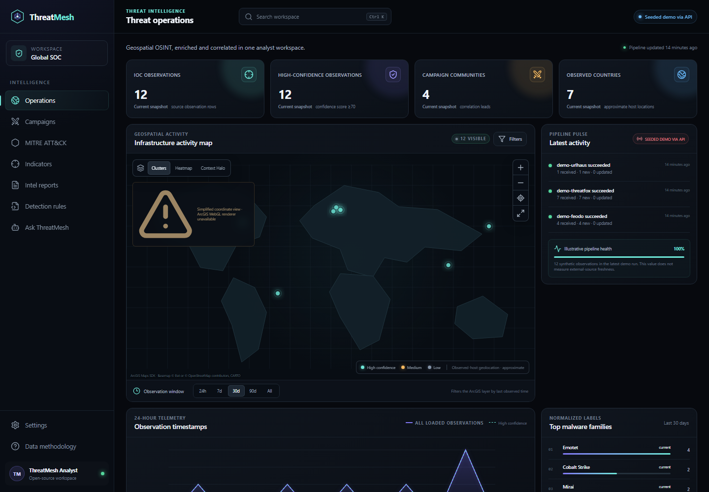
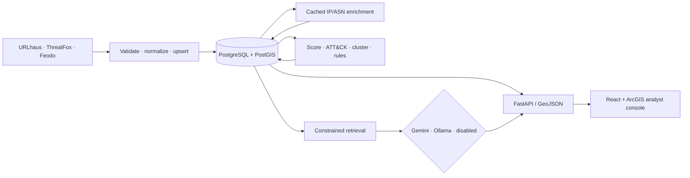

# ThreatMesh

**Passive OSINT in. Analyst-ready context out.**

[](https://github.com/Anubhav-Bora/Threat-Mesh/actions/workflows/ci.yml)
[](backend/pyproject.toml)
[](frontend/package.json)
[](LICENSE)

ThreatMesh is a self-hosted cyber-threat intelligence workspace. It collects
public indicators from community feeds, preserves provenance, enriches literal
IP addresses, maps known malware behavior to MITRE ATT&CK, groups related
infrastructure into campaign candidates, and turns high-confidence observations
into reviewable detection content. A geospatial analyst console makes the
result explorable without presenting estimated location or generated prose as
ground truth.

The useful security work is deterministic. Gemini or a local Ollama model can
write a report and phrase retrieval-backed answers, but neither provider can
change confidence, technique mapping, clustering, or response decisions.



## What is included

| Capability | Implementation |
|---|---|
| Passive collection | Bounded async connectors for URLhaus, ThreatFox, and Feodo Tracker with normalized, idempotent upserts and feed-run history |
| Geospatial context | Cached backend-only IP/ASN enrichment, PostGIS geography points, clustering, heatmap, and illustrative geodesic uncertainty views |
| Intelligence analysis | Explainable confidence scoring, ATT&CK STIX catalog/mapping, and graph-based Louvain campaign candidates |
| Detection engineering | Stable Sigma and Suricata templates with provenance and mandatory human-review labeling |
| Analyst reporting | Evidence-bounded weekly or monthly CTI reports with a persisted runtime schedule and configurable Gemini, local Ollama, or no-LLM operation |
| Natural-language access | Retrieval-first assistant with server-validated evidence IDs, forged-citation rejection, and exact record pivots instead of unrestricted text-to-SQL |
| Operations | APScheduler jobs, health/readiness probes, audit-friendly feed runs, rate limits, admin-key protection, Alembic migrations, and deterministic demo seeding |
| Portfolio UX | Responsive React/TypeScript console with overview, indicators, campaigns, ATT&CK, rules, reports, assistant, and settings workspaces |

## Architecture



The detailed [architecture](docs/architecture.md),
[methodology](docs/methodology.md), [operations guide](docs/operations.md), and
[architecture decisions](docs/decisions/) describe trust boundaries and the
trade-offs behind the design.

## Quick start

Requirements: Docker Desktop (or Docker Engine with Compose) and about 4 GB of
free memory. No account or API key is needed for the seeded demo.

```powershell
Copy-Item .env.example .env
docker compose up --build -d
docker compose exec backend python -m app.demo_seed
```

On macOS or Linux, use `cp .env.example .env` for the first command.

Open:

- Analyst console: <http://localhost:3000>
- Interactive API: <http://localhost:8000/docs>
- Health: <http://localhost:8000/health>
- Readiness: <http://localhost:8000/ready>

The seed command is explicit, deterministic, and idempotent. It never runs by
itself and never contacts an external feed. Remove the seeded records or use a
fresh database before evaluating live collection.

Seeded rows remain marked as demo data in PostgreSQL. The console explicitly
labels the corpus as seeded demo, live, mixed, or empty, so a successful HTTP
response can never erase dataset provenance. Demo and live evidence is never
combined for corroboration or campaign edges; in a mixed corpus, operational
analytics and newly generated artifacts use the live partition.

Compose binds both web ports to `127.0.0.1` by default. Administrative API
operations remain disabled until you set `ADMIN_API_KEY`; the demo seed runs
inside the backend container and does not weaken that boundary.

Stop the stack with `docker compose down`. Database data remains in the named
volume; `docker compose down -v` intentionally removes it.

## Enabling live services

| Service | Needed for | Account |
|---|---|---|
| abuse.ch Auth-Key | URLhaus and ThreatFox collection | Free, required for current APIs |
| ArcGIS Location Platform | Optional premium basemap style | Free-tier browser key, optional; public ArcGIS World Imagery works without one |
| Google AI Studio | Gemini report/assistant prose | Free-tier backend key, optional |
| Ollama | Local report/assistant prose | No account, optional local install |
| Feodo Tracker | Feodo collection | None |
| ip-api | Non-commercial demo geolocation | None; HTTP-only free endpoint |
| MITRE ATT&CK | Technique catalog | None |

Follow [external service setup](docs/api-accounts.md) for current signup steps,
key restrictions, free-tier limitations, and data-use notes. Two details are
easy to miss:

- `ABUSECH_AUTH_KEY` and `GEMINI_API_KEY` are server secrets.
- `VITE_ARCGIS_API_KEY` is visible in the built browser app by design. Restrict
  it by allowed referrers, service privileges, and expiry in the ArcGIS portal.
- Google's current Gemini terms allow free-tier inputs and outputs to be used
  to improve its products, including human review. Send only public OSINT or
  use the local Ollama option; recheck the terms before deployment.

After editing `.env`, rebuild affected services:

```powershell
docker compose up --build -d
```

## Local development

### Backend

```powershell
cd backend
python -m venv .venv
.\.venv\Scripts\Activate.ps1
python -m pip install -e ".[dev]"
Copy-Item .env.example .env
$env:DATABASE_URL = "sqlite+aiosqlite:///./threatmesh-dev.sqlite3"
$env:SCHEDULER_ENABLED = "false"
uvicorn app.main:app --reload
```

SQLite is a convenience path for tests and API development. Use the Compose
PostGIS service to exercise geography indexes and production migrations.

### Frontend

```powershell
cd frontend
npm ci
Copy-Item .env.example .env
npm run dev
```

The Vite server proxies `/api` to the local FastAPI service. Set
`VITE_DEMO_MODE=true` to force the bundled dataset. When the API is reachable
but empty, the UI shows an empty state rather than silently substituting demo
records.

### Quality checks

```powershell
make lint
make test
```

On Windows without `make`, run the equivalent commands directly:

```powershell
cd backend
python -m ruff check .
python -m ruff format --check .
python -m pytest

cd ..\frontend
npm run format:check
npm run lint
npm run typecheck
npm test
npm run build
```

## Repository map

```text
backend/
  app/
    ingestion/       source-isolated connectors and normalization
    enrichment/      literal-IP geolocation and ASN cache
    attack_mapping/  ATT&CK STIX catalog and reviewed aliases
    clustering/      graph construction and community detection
    scoring/         explainable confidence calculation
    detection_rules/ review-gated Sigma and Suricata generation
    genai/            evidence-first provider abstraction
    api/              versioned REST and GeoJSON contracts
  alembic/            production schema history
  tests/              network-free behavioral tests
frontend/
  src/                analyst workspaces, map, charts, and API client
docs/                  architecture, methodology, setup, and decisions
reports/               versionable report artifacts
rules/                 versionable detection artifacts
```

## Safety and limitations

- ThreatMesh is passive and defensive. It never scans, probes, or opens an
  ingested IOC.
- IP location is an estimate of network infrastructure, not a person or exact
  physical host. The interface uses illustrative geodesic uncertainty circles;
  their radius is a visual context buffer, not a calibrated error bound.
- Campaigns are correlation candidates, not actor attribution.
- Confidence is a queue-prioritization heuristic, not a probability or verdict.
- Generated rules and prose require analyst review and are never deployed
  automatically.
- Assistant citation validation proves that a displayed evidence ID belonged to
  that request's retrieved fact set; it does not prove that every generated
  sentence is semantically supported.
- The free ip-api service is HTTP-only and non-commercial. Use a licensed HTTPS
  provider or offline database for commercial or higher-assurance deployment.

Read the [security policy](SECURITY.md) before exposing an instance outside a
trusted development network.

## Deliberate scope boundaries

- PhishTank and NVD are not connected in this release. PhishTank was optional
  in the brief; NVD is deferred because the primary feeds do not provide a
  reliable IOC-to-CVE relationship and keyword inference would be misleading.
- A country choropleth is deferred until a reviewed country-polygon dataset is
  introduced. Point counts are not mislabeled as polygon analysis. The current
  ArcGIS views provide clusters, density heatmaps, and uncertainty radii.
- Time filtering uses a transparent observation-window control instead of the
  TimeSlider widget deprecated in ArcGIS Maps SDK 5.x.
- ThreatMesh exports detection/report artifacts but never commits them or
  changes Git history automatically. Analyst review remains an explicit step.

## Lessons learned

The hardest part was not drawing a map or calling a model; it was preserving
meaning while data crossed systems. Feed authentication and schemas change,
IP-and-port observations need a stricter identity than bare strings, estimated
locations need visible uncertainty, and generated prose needs an evidence
boundary. Keeping those concerns explicit produced a smaller but more honest
system: deterministic analysis remains testable, external integrations can
fail independently, and every analyst-facing artifact retains provenance and a
review step.

## Contributing and license

Contributions are welcome under the guidelines in [CONTRIBUTING.md](CONTRIBUTING.md).
ThreatMesh is released under the [MIT License](LICENSE).

MITRE ATT&CK® and ATT&CK® are registered trademarks of The MITRE Corporation.
ThreatMesh uses ATT&CK data under MITRE's published terms and is not endorsed
by MITRE. Third-party feed and platform data remains subject to each provider's
terms.
