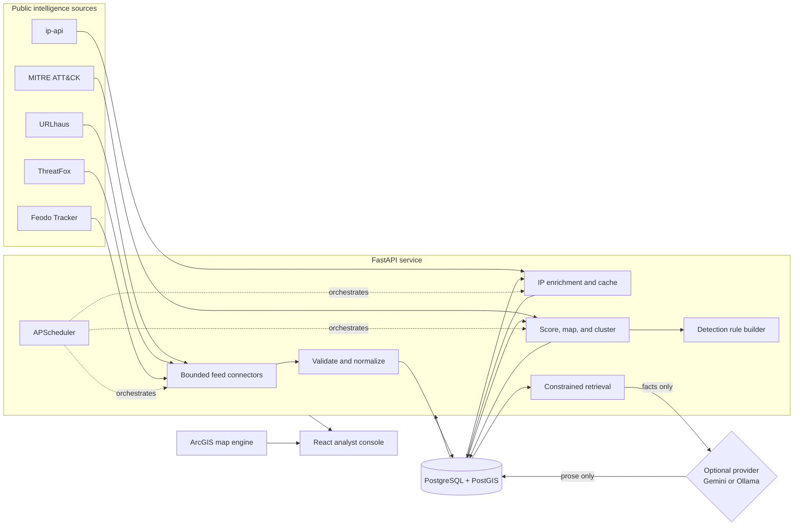

# ThreatMesh architecture

ThreatMesh separates collection, deterministic analysis, presentation, and
optional language generation so each result can be traced back to source data.

## Component boundaries

### Collection

Each feed has an isolated connector responsible for transport and source-shape
parsing. A shared normalization layer validates IOC types, timestamps, and
length limits before an upsert. The
`(ioc_type, indicator_key, source_feed)` constraint makes repeated
synchronization safe while retaining cross-feed corroboration. `indicator_key`
is the normalized value/port identity, so observations with different types or
network ports remain distinct detection candidates.

Feed failures are recorded independently. One unavailable source does not roll
back successful results from another source, and fixture-based tests do not
call public services.

### Storage and geospatial analysis

PostgreSQL is the system of record. Coordinates are stored both as inspectable
numeric fields and a PostGIS `GEOGRAPHY(POINT, 4326)` value with a GiST index.
An enrichment cache avoids repeatedly sending the same address to the
geolocation provider.

SQLite is supported for isolated tests and lightweight local API development;
PostGIS remains the production path for spatial indexing and queries.

### Deterministic analytics

Confidence scoring combines source corroboration, source reputation, recency,
and available context. ATT&CK tags come from a curated malware-family mapping
backed by the official STIX catalog. Campaign candidates are graph communities
connected by a repeated canonical indicator, or by a shared malware family or
ASN inside the configured observation window. Time proximity can strengthen
one of those relationships but never creates a campaign edge by itself. Every
one of these operations is repeatable without an AI service.

Demo and live provenance is part of each analytical identity. Corroboration,
confidence, and graph edges never cross that boundary. In a mixed database,
operational aggregates and generated artifacts use live observations; demo
records remain separately inspectable.

Detection generation emits reviewable Sigma or Suricata text. Generated
content carries provenance and a `requires_review` flag and is never deployed
by the application.

### API and presentation

FastAPI publishes versioned JSON and GeoJSON contracts. The React application
uses those contracts for overview metrics, point clusters, density rendering,
campaign inspection, ATT&CK trends, rules, reports, and assistant evidence.
The browser receives only a restricted ArcGIS browser key; backend and AI
credentials never enter the frontend bundle.

The UI includes an explicit local demo fallback for an unavailable API. Seeded
rows also carry persisted provenance, and the API reports whether its corpus is
demo, live, mixed, or empty. An empty but healthy API is shown as an empty
workspace, so sample records are never silently presented as live observations.

### Language generation

Language models sit after retrieval. The weekly report receives aggregates
already computed by ThreatMesh. The assistant receives the user's question and
a bounded set of matching database facts. Provider output changes prose, not
scores, tags, clusters, or response actions. See
[ADR 0001](decisions/0001-deterministic-analysis-before-generation.md).

## Trust boundaries

| Boundary | Main risk | Control |
|---|---|---|
| Public feed → backend | Malformed or hostile content | Typed normalization, streamed size limits, timeouts, IOC rendering as text |
| Demo data → live analysis | Synthetic evidence contaminates an operational conclusion | Persisted provenance, partitioned analytics, explicit corpus and analysis scope |
| Backend → geolocation | Data disclosure and rate exhaustion | Public IPs only, cache, bounded batches, documented non-commercial terms |
| Backend → cloud LLM | Prompt retention and unsupported claims | Public OSINT only, evidence-only prompt, optional provider, local Ollama path |
| Browser → ArcGIS | Leaked unrestricted browser credential | Origin- and service-restricted key, environment injection, no server secrets |
| Generated rules → analyst | False positives or unsafe deployment | Stable provenance, review banner, download only, no automatic enforcement |

## Scaling notes

- Run the scheduler in one process only. In a horizontally scaled deployment,
  move jobs to a dedicated worker or external scheduler.
- Keep ingestion and enrichment batch sizes bounded; the free geolocation tier
  is intentionally slower than the database.
- For large installations, move graph construction to an offline job and
  retain a rolling analysis window rather than loading the full IOC corpus.
- Store application secrets in the hosting platform's secret manager and run
  Alembic migrations as a release step.
